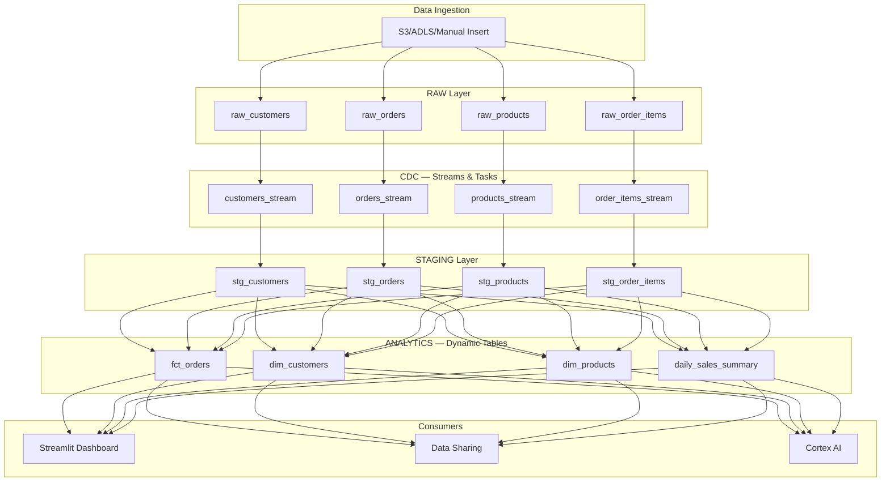

# Snowflake Sales DW Pipeline

End-to-end data warehouse built using pure Snowflake features — no external tools. Covers RBAC, CDC with Streams & Tasks, Dynamic Tables, Time Travel, Data Sharing, Snowpark, Cortex AI, and cost monitoring.

---

## Architecture



## Project Structure

```
├── 01_foundation/          # RBAC, roles, grants, warehouses
├── 02_ingestion/           # Raw tables, stages, file formats, sample data
├── 03_streams_tasks/       # CDC pipeline (RAW → STAGING)
├── 04_dynamic_tables/      # Auto-refreshing analytics layer
├── 05_time_travel/         # Time Travel, UNDROP, Zero-Copy Cloning
├── 06_data_sharing/        # Secure views and shares
├── 07_snowpark/            # Python DataFrames, UDFs, Stored Procedures
├── 08_cortex_ai/           # LLM functions (sentiment, classify, extract)
├── 09_monitoring/          # Resource monitors, cost views
└── 10_streamlit/           # Interactive sales dashboard
```

## Execution Order

Run the SQL files in numbered order (01 → 09). Notebooks (07, 08) can be run independently in Snowflake Notebooks.

## Features Demonstrated

| Phase | Feature | Snowflake Concept |
|-------|---------|-------------------|
| 1 | Access Control | Roles, Grants, Future Grants, Warehouses |
| 2 | Data Loading | Stages, File Formats, COPY INTO |
| 3 | Change Data Capture | Streams, Tasks, MERGE, SYSTEM$STREAM_HAS_DATA |
| 4 | Auto-Refresh Analytics | Dynamic Tables, TARGET_LAG |
| 5 | Data Recovery | Time Travel, UNDROP, Zero-Copy Clone |
| 6 | Collaboration | Secure Views, Shares |
| 7 | Python on Snowflake | Snowpark DataFrames, UDFs, Stored Procedures |
| 8 | AI/ML | AI_COMPLETE, AI_SENTIMENT, AI_CLASSIFY, AI_EXTRACT, AI_FILTER, AI_TRANSLATE, AI_REDACT |
| 9 | Cost Management | Resource Monitors, Account Usage Views |
| 10 | Dashboards | Streamlit in Snowflake |

## RBAC Model

```
            ACCOUNTADMIN
                 │
          ┌──────┼──────┐
          ▼      ▼      ▼
     SYSADMIN  SECURITYADMIN  USERADMIN
          │
   ┌──────┼──────────┐
   ▼      ▼          ▼
DEVELOPER ANALYST  PIPELINE_ROLE
   │      │          │
   ▼      ▼          ▼
DEV_WH  REPORT_WH  PIPELINE_WH
```

## Data Flow

```
INSERT/COPY INTO raw table
    │ (immediate)
    ▼
Stream captures change
    │ (< 1 minute — Task checks every 1 min)
    ▼
Task MERGEs into staging (cleaned, trimmed, uppercased)
    │ (< 5 minutes — Dynamic Table TARGET_LAG)
    ▼
Analytics tables auto-refresh
    │
    ▼
Streamlit dashboard shows latest data
```


## Cost Optimization

- All warehouses auto-suspend (60-120 seconds)
- Resource monitor limits daily spend to 10 credits
- Tasks only run when streams have data (no idle compute)
- Dynamic Tables only refresh when upstream data changes

## Considerations

- Haven't used Snowpipe (or) Bulkload from external ADLS/S3/GCS. Just insterted data into raw tables directly.
- As an extension, external stage can be configured and data can be pulled from external storages. 
